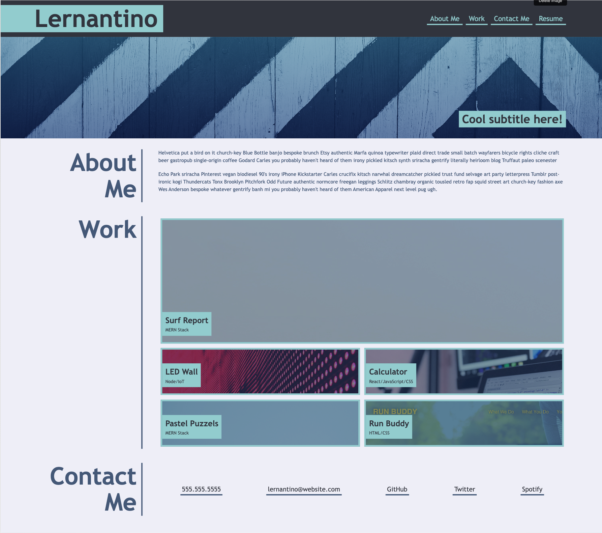
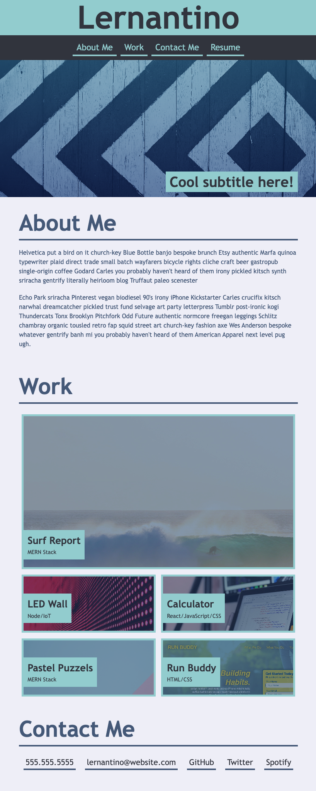
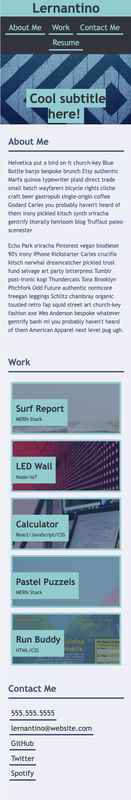

# Portfolio-Challenge-2
**[My Portfolio Page link](https://salidamaharjan.github.io/portfolio-challenge-2/){:target="_blank"}**

## Building a responsive portfolio using html, css.

## The page will look as follow in the large screen.

* The HTML boilerplate was added and the foundation for the page was created.
* Required semantic html tag used and placeholder images were linked.
* Styling given using CSS variable, CSS selectors, flex and grid layout, pseudo-class.
* The links on the tab will scroll down to the respected sections on the page.
* When hovered on the images on the work section, the image gets brighter than other as if it is highlighted.
* When click on the image of work section, will direct to the deployed application page.

### The page will look as follows in the medium and small screen as it reaches certain break point.
* Used media query to add break out point.
* Used flex-box property(flex-direction to column) to stack the header logo and navigation vertically.
* Similarly, the the flex-box property was used on the about me section as well.
Small Screen for width 576px or less.

* For work section grid property was used

Medium Screen for width 768px or less

* The flex-box property(flex-direction to column) was used Contact Me section.

### All the feature remains same for every screen type.

**[My GitHub Repo link](https://github.com/salidamaharjan/portfolio-challenge-2)**