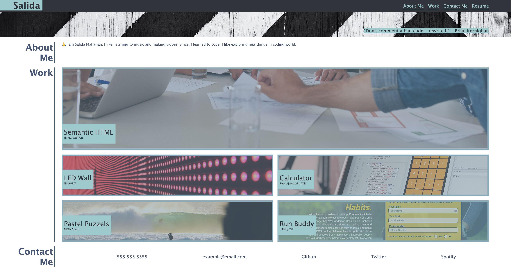
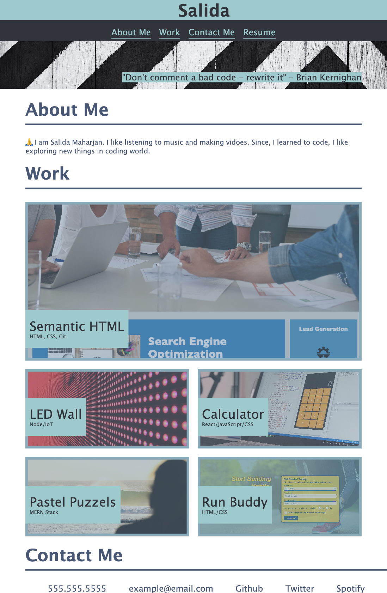
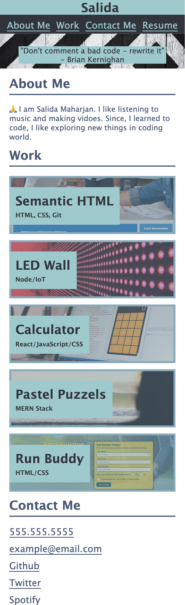

# Portfolio-Challenge-2
**[My Portfolio Page link](https://salidamaharjan.github.io/portfolio-challenge-2/)**

## Description
* Building a responsive portfolio using html, css.
* The foundation for the page is created using HTML.
* Required semantic html tag is used so that the screen reader can read the content properly.
* In image tag, I used alt to give the description about the image for accessibility.
* CSS variable is used to hold the common values.
* Display flex and grid are used to make the layout. This will make the creating responsive layout easier.
* This page is responsive by design, set break-points are 768px for medium screen and 576px for small screen.
* All the feature remains same for every screen type.

### The page on large screen.(width greater than 768px)

* The links on the tab will scroll down to the respected sections on the page.
* When hovered on the images on the work section, the image gets brighter than other as if it is highlighted.
* When click on the image of work section, will direct to the deployed application page.

### The page on medium screen.(width 768px or less and greater than 576px)

* Used media query to add break out point.
* Used flex-direction column to change how flex layout works. This allowed me to stack the header logo and navigation vertically.
* Similarly, the the flex-direction column property is used on the about me section as well.

### The page on small screen.(width less than 576px)

* Grid layout is used to set the images in work section. The number of column is changed to one.
* The row height is changed to same for all image.
* The flex-direction column is used Contact Me section to stack the items.

**[My GitHub Repo link](https://github.com/salidamaharjan/portfolio-challenge-2)**